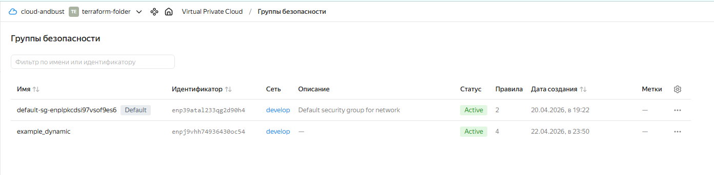
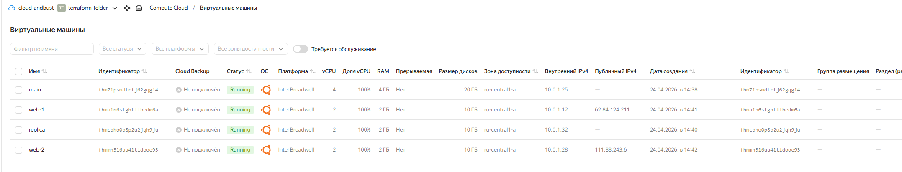
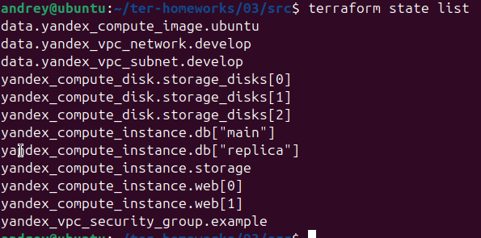
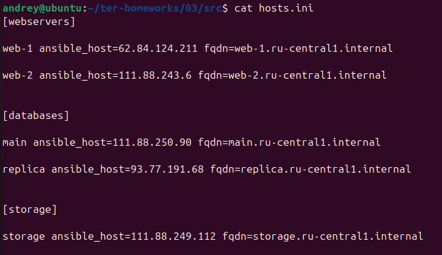

# Домашнее задание к занятию "`Управляющие конструкции в коде Terraform`" - `Сунцов Андрей`

---

### Задание 1

`скриншот входящих правил «Группы безопасности» в ЛК Yandex Cloud`

---

### Задание 2

`скриншот ВМ`

---

### Задание 3

`скриншот команды terraform state list`

---

### Задание 4

`содержимое файла hosts.ini`

