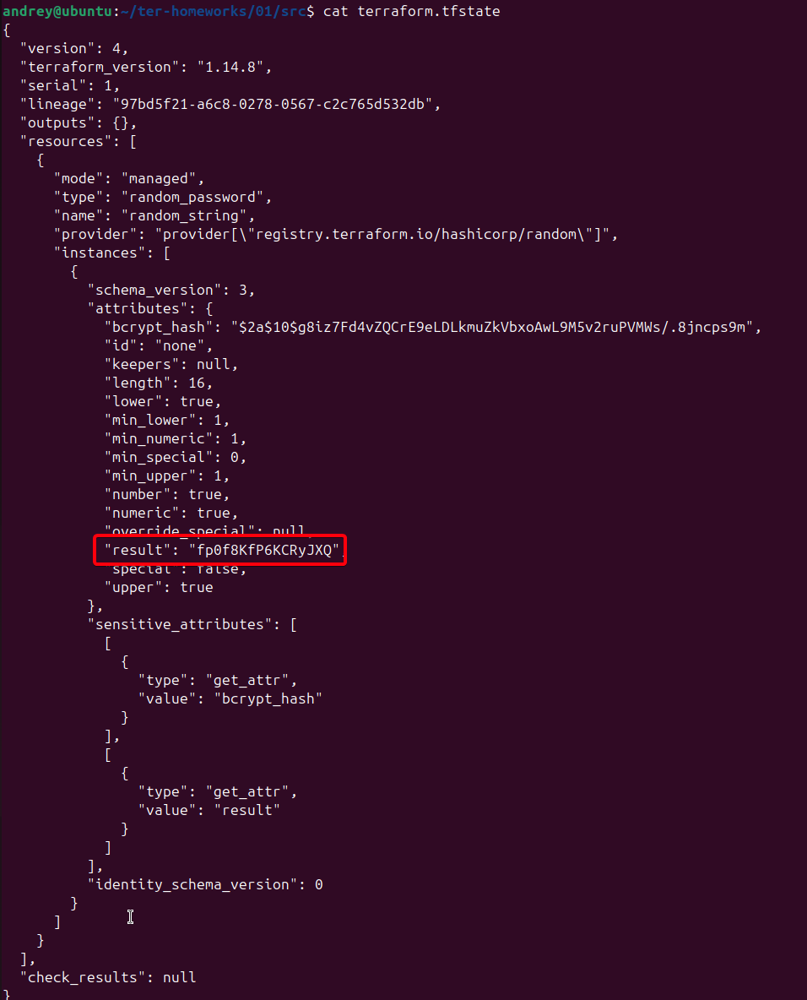
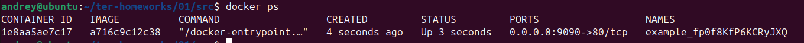
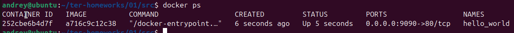
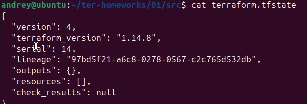

# Домашнее задание к занятию "`Введение в Terraform`" - `Сунцов Андрей`


---

### Задание 1

`В каком terraform-файле, согласно этому .gitignore, допустимо сохранить личную, секретную информацию?`

`personal.auto.tfvars`

---

`Найдите в state-файле секретное содержимое созданного ресурса random_password, пришлите в качестве ответа конкретный ключ и его значение.`

`Cкриншот содержимого файла terraform.tfstate`



---

`Раскомментируйте блок кода, примерно расположенный на строчках 29–42 файла main.tf. Выполните команду terraform validate. Объясните, в чём заключаются намеренно допущенные ошибки.`

1. У resource "docker_image" нет локального имени
2. Некорректное имя resource "docker_container" "1nginx"
3. Неверная ссылка на random_password:
	1. random_password.random_string_FAKE
	2. resulT

---

`Выполните код. В качестве ответа приложите: исправленный фрагмент кода и вывод команды docker ps.`

`Исправленый фрагмент кода:`

```bash
resource "docker_image" "nginx" {
  name         = "nginx:latest"
  keep_locally = true
}

resource "docker_container" "nginx" {
  image = docker_image.nginx.image_id
  name  = "example_${random_password.random_string.result}"

  ports {
    internal = 80
    external = 9090
  }
}
```

`Cкриншот команды docker ps`



---

`Объясните своими словами, в чём может быть опасность применения ключа -auto-approve`

`можно случайно удалить или изменить важные ресурсы`

`Догадайтесь или нагуглите зачем может пригодиться данный ключ?`

1. в CI/CD пайплайнах
2. в тестировании - быстро очистить тестовую инфраструктуру
3. в скриптах

`Cкриншот команды docker ps`



---

`Приложите содержимое файла terraform.tfstate`

`Cкриншот содержимого файла terraform.tfstate`



---

`Объясните, почему при этом не был удалён docker-образ nginx:latest`

`В коде присутствует строка keep_locally = true. Она означает, что Terraform не должен удалять Docker-образ при выполнении terraform destroy`

`ОБЯЗАТЕЛЬНО ПОДКРЕПИТЕ строчкой из документации terraform провайдера docker`

`keep_locally (Boolean) If true, then the Docker image won't be deleted on destroy operation. If this is false, it will delete the image from the docker local storage on destroy operation.`