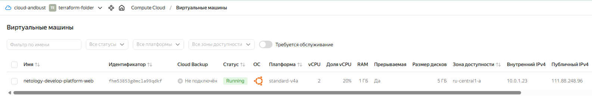
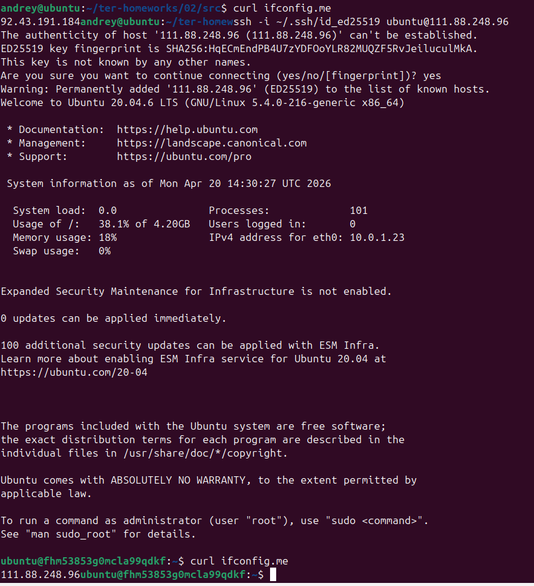
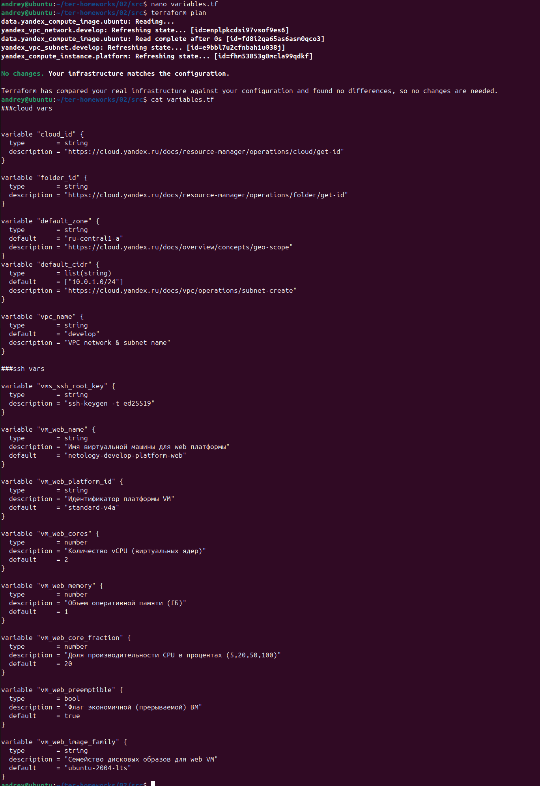
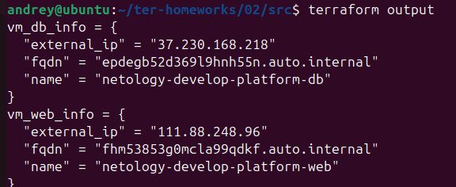
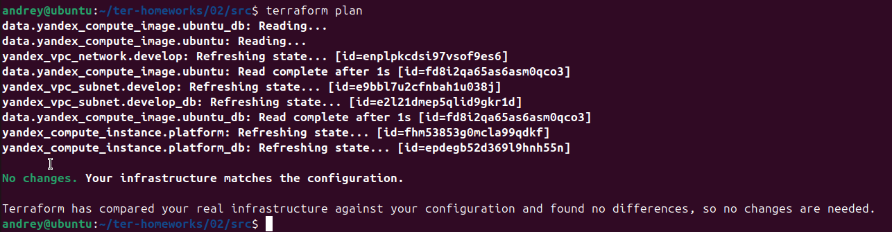

# Домашнее задание к занятию "`Основы Terraform. Yandex Cloud`" - `Сунцов Андрей`

---

### Задание 1

`скриншот ЛК Yandex Cloud с созданной ВМ, где видно внешний ip-адрес`

---

`скриншот консоли, curl должен отобразить тот же внешний ip-адрес`

---

`ответы на вопросы`

1. Ошибка в файле main.tf: platform_id = "standart-v4" -> platform_id = "standard-v4"
2. preemptible = true - делает ВМ прерываемой, то есть дешёвой: Yandex Cloud может остановить её в любой момент
3. core_fraction = 5 - задаёт долю производительности CPU, выделенную ВМ.

---

### Задание 2

`скриншот команды terraform plan`

---

### Задание 3

Выполнено. Исходя из задания предоставлять данные о выполнении не требуется.

---

### Задание 4

`вывод значений ip-адресов команды terraform output`

### Задание 5

Выполнено. Исходя из задания предоставлять данные о выполнении не требуется.

---

### Задание 6

`скриншот команды terraform plan`

---